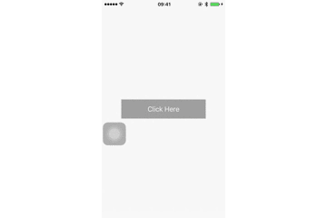

#UUActionSheet

[](https://raw.githubusercontent.com/dexianyinjiu/UUActionSheet/master/LICENSE)&nbsp;
[](https://cocoapods.org/pods/UUActionSheet)&nbsp;
[](https://cocoapods.org/pods/UUActionSheet)&nbsp;

高仿微信、新浪微博的ActionSheet，使用方式和UIActionsheet相同，支持屏幕旋转。

#Usage



### CocoaPods

1. `pod 'UUActionSheet', '~> 1.0'`;
2. `pod install` / `pod update`;
3. `#import <UUActionSheet/UUActionSheet.h>`.

For example：

```objc
UUActionSheet *actionSheet = [[UUActionSheet alloc] initWithTitle:@"After the exit will not delete any historical data, the next login can still use this account."
                                                         delegate:self
                                                cancelButtonTitle:@"Cancel"
                                           destructiveButtonTitle:@"Logout"
                                                otherButtonTitles:@"Okay",nil];
                                          [actionSheet showInView:self.view.window];
```

```objc
#pragma mark - UUActionSheetDelegate
- (void)actionSheet:(UUActionSheet *)actionSheet clickedButtonAtIndex:(NSInteger)buttonIndex
{
    NSLog(@"buttonIndex:%ld",buttonIndex);
}
```

#Requirements

This library requires `iOS 7.0+` and `Xcode 7.0+`.


#License

UUActionSheet is provided under the MIT license. See LICENSE file for details.


