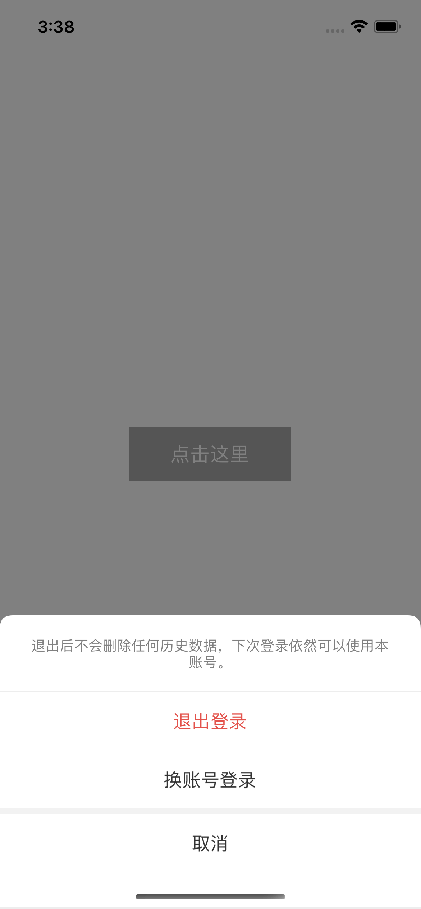

# UUActionSheet

[](https://raw.githubusercontent.com/ChaneyLau/UUActionSheet/master/LICENSE)&nbsp;
[](https://cocoapods.org/pods/UUActionSheet)&nbsp;
[](https://cocoapods.org/pods/UUActionSheet)&nbsp;
[](https://www.apple.com/nl/ios/)&nbsp;


自定义样式的`ActionSheet`，使用方式和`UIActionsheet`相同，代理也是仿照`UIActionSheet`写的。


## 使用 

1. `pod "UUActionSheet"`;
2. `pod install` / `pod update`;
3. `#import <UUActionSheet.h>`.

## 示例 


```objc
UUActionSheet *actionSheet = [[UUActionSheet alloc] initWithTitle:@"退出后不会删除任何历史数据，下次登录依然可以使用本账号。"
                                                         delegate:self
                                                cancelButtonTitle:@"取消"
                                           destructiveButtonTitle:@"退出登录"
                                                otherButtonTitles:@"换账号登录",nil];
[actionSheet showInView:self.view.window];
```

```objc
#pragma mark - UUActionSheetDelegate
- (void)actionSheet:(UUActionSheet *)actionSheet clickedButtonAtIndex:(NSInteger)buttonIndex
{
    NSLog(@"buttonIndex: %ld",buttonIndex);
}
```

## 效果图


